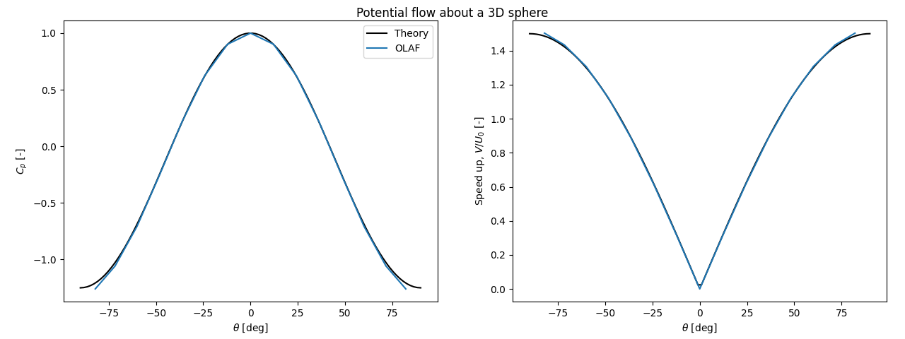
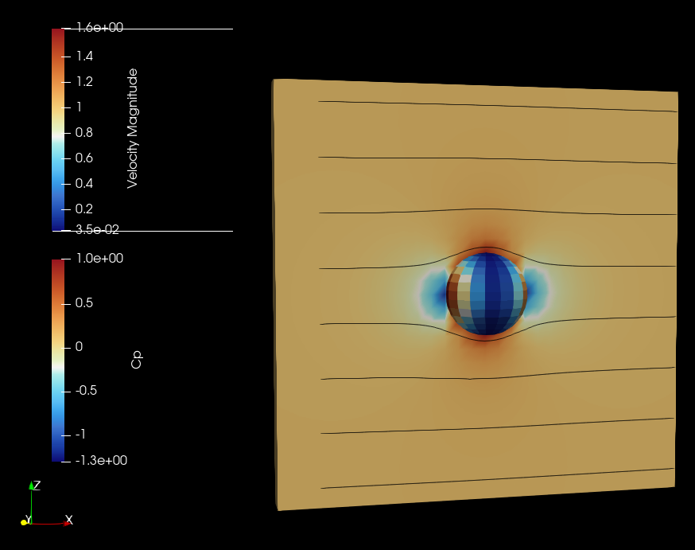

# Potential Flow About a Sphere

This test case computes the potential flow about a 3D sphere using the source panel method.

The geometry of the sphere is defined using quad-panels in the VTK file: `Sphere_17_15.vtk`.

The analytical solution for the velocity field, speed-up, and pressure coefficient can be found in reference [1], Chapter 34.1.

Note: The source panel method of OLAF can support arbitrary distributions of stationary panels, and the panels can be combined with OLAF lifting lines for two-way interactions between wings and the panels (e.g., flow confinement; see the [OLAF documentation](https://ebranlard-openfast.readthedocs.io/en/main/source/user/aerodyn-olaf/InputFiles.html#advanced-options)).

## Setup

There are no blades, tower, hub, or nacelle.

The AeroDyn file points to an OLAF input file, which itself points to the VTK file that contains the geometry of the sphere, discretized into panels.

- Sphere radius: R = 1 m
- Wind speed: U0 = 1 m/s
- Number of panels in the `theta` direction: 16
- Number of panels in the `phi` direction: 17

The panel file was generated using the routine `EllipsoidPanels` from the file `FVW_VortexTools.f90` of OLAF.

## Results

The analytical formulae for the pressure coefficient and speed-up are given by [1]:

$$
C_p = \frac{1}{4} \left( 9 \cos^2(\theta) - 5 \right)
$$

$$
\text{SpeedUp} = \frac{3}{2}  \lvert \sin(\theta) \rvert
$$

The script `PlotCp.py` in this directory compares the numerical values with the analytical ones. (Note: a low resolution is used for this test case, which explains the small discrepancies.)

The VTK file produced can be visualized with Paraview. An example is given below:

## Reference

[1] Branlard (2017) *Wind Turbine Aerodynamics and Vorticity-Based Methods: Fundamentals and Recent Applications*, Springer, ISBN: 978-3-319-55163-0

