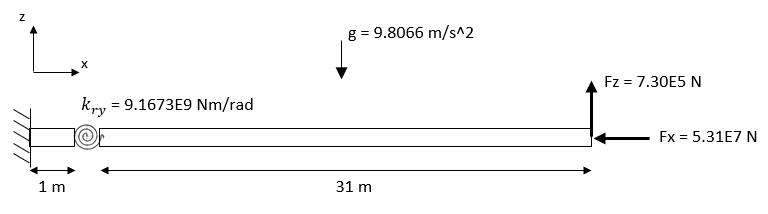

# Revolute Joint Verification

Two beams linked by means of a revolute joint with a rotational stiffness of 9.1673E9 Nm/rad (no rigid-body mode in the system). Two steady loads are applied at the free-end of the beam. The system is subject to the gravity acceleration.

# Geometry and Material Properties

| Parameter | Value | Units |
|-----------|-------|-------|
| Beam 1 length | 1 | m |
| Beam 2 length | 31 | m |
| Beam diameter | 2.1 | m |
| Young Modulus | 4.2×10¹⁰ | N/m² |
| Poisson ratio | 0.2 | - |
| Material density | 1375 | kg/m³ |

# Verification:

Comparison of horizontal (x) and vertical (z) displacements as well as shear force and bending moments along the beams.

The solution from an ANSYS model is provided for reference: `ANSYS_reference_results.txt`.