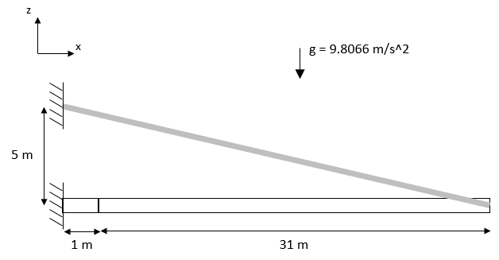

# Cable Verification

One cantilever beam with a pretensioned cable attached at the free-end. The system is subject to the gravity acceleration.

# Geometry and Material Properties

| Parameter | Value | Units |
|-----------|-------|-------|
| Beam length | 32 | m |
| Beam diameter | 2.1 | m |
| Young Modulus | 4.2×10¹⁰ | N/m² |
| Poisson ratio | 0.2 | - |
| Material density | 1375 | kg/m³ |

# Cable Properties

| Parameter | Value | Units |
|-----------|-------|-------|
| Initial pretension | 6.26×10⁶ | N |
| Axial stiffness (EA) | 1.5151×10¹⁰ | N |

# Verification:

Comparison in terms of horizontal (x) and vertical (z) displacements as well as axial force, shear force and bending moments along the beams.

The solution from ANSYS is available here: `ANSYS_reference_results.txt`.