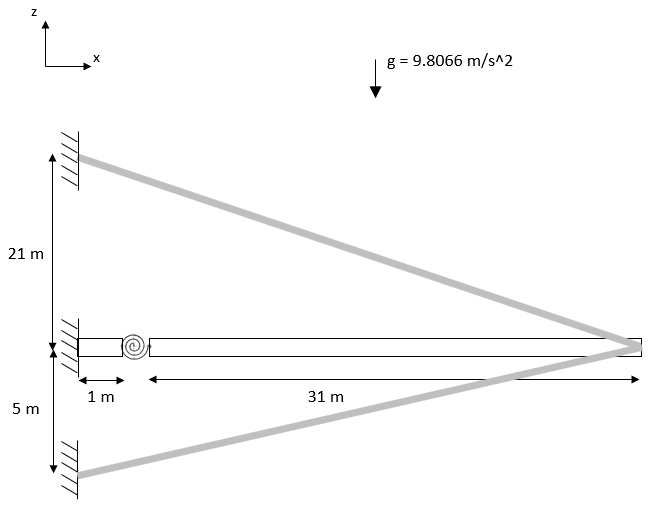

# Revolute Joint and Cable Verification

Two beams connected by a revolute joint and two pretensioned cables at the free-end of one of the beams. This regression test is a combination of the `SD_AnsysComp1_PinBeam` and `SD_AnsysComp2_Cable` tests. The system is subject to the gravity acceleration.

# Geometry and Material Properties

| Parameter | Value | Units |
|-----------|-------|-------|
| Beam 1 length | 1 | m |
| Beam 2 length | 31 | m |
| Beam diameter | 2.1 | m |
| Young Modulus | 4.2×10¹⁰ | N/m² |
| Poisson ratio | 0.2 | - |
| Material density | 1375 | kg/m³ |

# Upper Cable Properties

| Parameter | Value | Units |
|-----------|-------|-------|
| Initial pretension | 5.634×10⁷ | N |
| Axial stiffness (EA) | 1.6065×10¹⁰ | N |

# Lower Cable Properties

| Parameter | Value | Units |
|-----------|-------|-------|
| Initial pretension | 6.26×10⁷ | N |
| Axial stiffness (EA) | 1.5095×10¹⁰ | N |

# Verification:

Comparison in terms of horizontal (x) and vertical (z) displacements as well as axial force, shear force and bending moments along the beams.

The solution from ANSYS is available here: `ANSYS_reference_results.txt`.