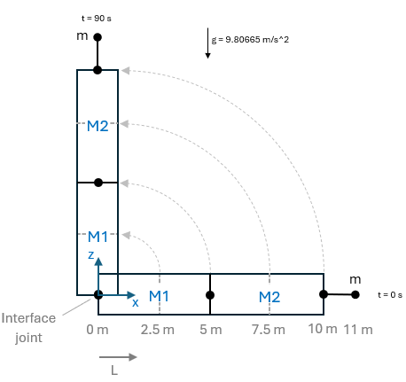

# Self-Weight Verification – Floating System (SubDyn)

Two members with NDiv = 2 and one concentrated mass with an eccentricity are subjected to the gravity acceleration and a prescribed 90 deg rotation (1 deg/s) via the interface joint.

# Geometry and Material Properties

| Parameter | Value | Units |
|-----------|-------|-------|
| Total beam length | 10 | m |
| Outer diameter | 5 | m |
| Wall thickness | 0.1 | m |
| Material density | 7860 | kg/m³ |
| Tip mass | 2000 | kg |
| Tip mass eccentricity | 1 | m |

# Verification:

The analytical solution is available in the MATLAB script: `Beams_self-weight_floating_system.m`.